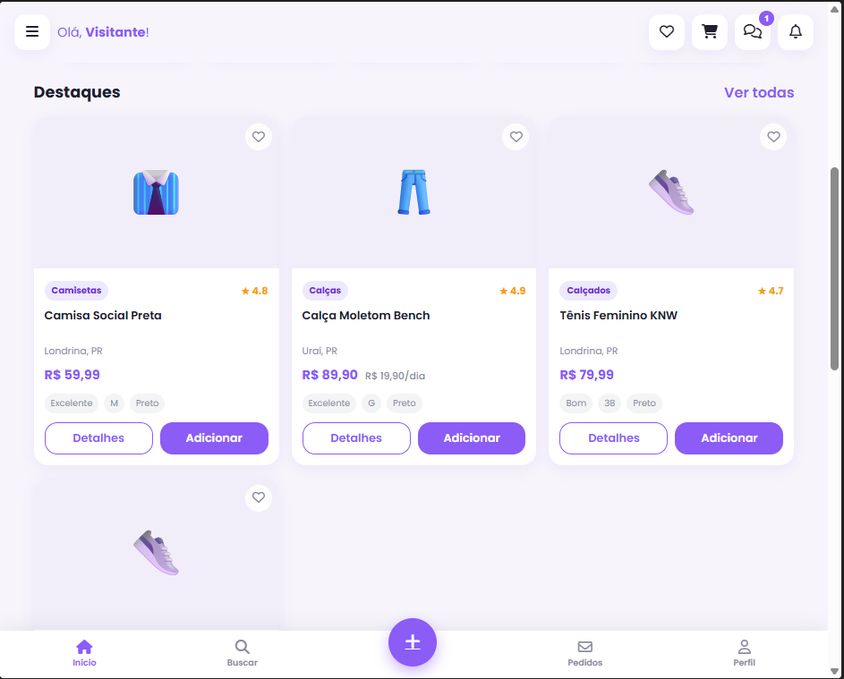
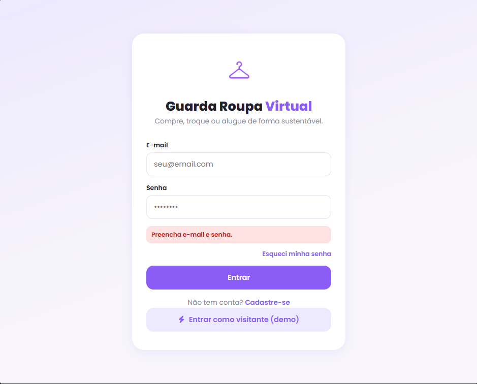
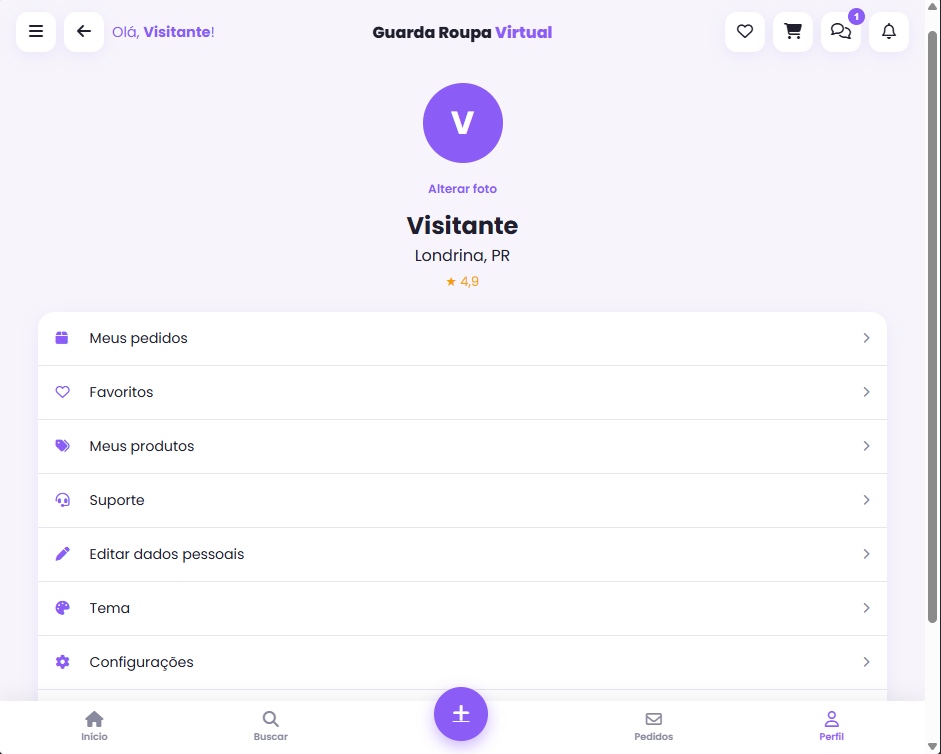

# Guarda-Roupa Virtual

Marketplace acadêmico de compra, venda, troca e aluguel de roupas, com foco em moda circular.

## Como executar

1. Instale o Node.js
2. Na pasta do projeto, execute:
   `npm install`
   `npm start`
3. Abra `http://localhost:3000` no navegador.

> O projeto precisa do servidor local em `server.js` para funcionar corretamente. Se abrir só o HTML, ele pode ficar incompleto ou "desconfigurado".

Conta de demonstração: `clayton@teste.com` / `123456`. Também é possível entrar como visitante.

## Funcionalidades

- Catálogo com busca, categorias, filtros e ordenação.
- Favoritos, carrinho com limite de estoque e cupons.
- Cadastro, login local e perfil.
- Publicação, edição e exclusão de anúncios com imagem.
- Checkout simulado, pedidos, avaliações, chat e suporte.
- Idioma em português, inglês e espanhol e moeda em BRL, USD ou EUR.

## Demonstração

Capturas de tela do site:

| Tela inicial | Catálogo de produtos |
| --- | --- |
|  |  |

| Login | Publicação de item |
| --- | --- |
|  |  |

| Perfil | Conversa com vendedor |
| --- | --- |
|  |  |

## Limitações atuais

Este projeto ainda é um protótipo local. Os dados de conta, pedidos e mensagens usam `localStorage`; a senha não deve ser armazenada assim em produção. O backend de produtos ainda não possui autenticação, banco de dados, pagamento real ou controle de autorização por usuário. Antes de publicar, é necessário adicionar API autenticada, hash de senhas, banco de dados, validação no servidor, armazenamento de imagens e gateway de pagamento.
